<div align="center">

# A2ABase SDKs


### Ship AI agents to production in minutes. Batteries included.

**Native Python & TypeScript SDKs for autonomous AI agents**

[](https://pypi.org/project/a2abase/)
[](https://www.npmjs.com/package/a2abase)
[](./LICENSE)
[](https://discord.gg/qAncfHmYUm)

<br/>

[](https://github.com/A2ABaseAI/sdks)

<br/>

[Introduction](#-introduction--why-a2abase) · [Quick Start](#-quick-start-guide) · [Use Cases](#-use-cases--templates) · [Tools](#-tools--integrations) · [Knowledge](#-knowledge--data) · [Videos](#-video-tutorials) · [SDK](#-advanced--sdk)

</div>

---

## 🎯 Introduction & Why A2ABase

A2ABase is an AI platform that lets you chat with AI agents, create custom agents, and automate work—all in one place.

### The Problem with Monolithic Agents

Building a single, all-in-one AI agent that handles everything doesn't scale well. When one part breaks, the whole system fails. Updates become risky, and debugging is a nightmare.

### The A2ABase Solution

A2ABase uses **orchestrated mini-agents**—small, focused agents that work together. Each agent does one thing well, making your system:

- **More reliable** — One failing component doesn't crash everything
- **Easier to debug** — Isolate issues quickly
- **Simpler to update** — Change one agent without affecting others
- **Production-ready** — Built for real-world scale

### What You Get

| Feature | Description |
|---------|-------------|
| **20+ LLM Models** | Use our models or bring your own API keys |
| **50+ Built-in Tools** | Web search, browser automation, file management, and more |
| **500+ MCP Integrations** | Gmail, Slack, GitHub, Notion, Salesforce, and hundreds more |
| **Secure Sandboxes** | Isolated execution for browser, shell, and file operations |

### Architecture

```mermaid
flowchart TB
    subgraph APP["Your Application"]
        A[Python / TypeScript]
    end

    subgraph SDK["A2ABase SDK"]
        B[Agent · Thread · Run · Tools]
    end

    subgraph PLATFORM["A2ABase Platform"]
        subgraph SERVICES[" "]
            C[LLM Router]
            subgraph SANDBOX["Sandbox Execution"]
                D1[Unlimited Parallel Workers]
                D2[No Infra Required]
            end
            subgraph MCP["MCP Hub · 500+ APIs"]
                E1[Gmail · Slack · Discord]
                E2[GitHub · Notion · Linear]
                E3[Stripe · Shopify · HubSpot]
                E4[AWS · GCP · Postgres]
            end
        end
        F[Langfuse · Usage Tracking]
    end

    subgraph PROVIDERS["LLM Providers"]
        G[OpenAI<br/>GPT-5.2]
        H[Google<br/>Gemini 3]
        I[Anthropic<br/>Claude 4.5]
        J[OpenRouter<br/>Grok · GLM]
    end

    APP --> SDK
    SDK --> PLATFORM
    C --> G
    C --> H
    C --> I
    C --> J

    style APP fill:#e0f2fe,stroke:#0284c7,color:#000
    style SDK fill:#dcfce7,stroke:#16a34a,color:#000
    style PLATFORM fill:#fef3c7,stroke:#d97706,color:#000
    style PROVIDERS fill:#f3e8ff,stroke:#9333ea,color:#000
    style MCP fill:#fce7f3,stroke:#db2777,color:#000
    style SANDBOX fill:#d1fae5,stroke:#059669,color:#000
```



<table>
<tr>
<td width="50%">

**Python**

```python
from a2abase import A2ABaseClient
from a2abase.tools import A2ABaseTools

client = A2ABaseClient(api_key="pk_xxx:sk_xxx")

agent = await client.Agent.create(
    name="Researcher",
    a2abase_tools=[A2ABaseTools.WEB_SEARCH_TOOL],
)

await agent.run("Find AI trends 2025", thread)
```

</td>
<td width="50%">

**TypeScript**

```typescript
import { A2ABase, A2ABaseTool } from 'a2abase';

const client = new A2ABase({ apiKey: 'pk_xxx:sk_xxx' });

const agent = await client.Agent.create({
  name: 'Researcher',
  a2abaseTools: [A2ABaseTool.WEB_SEARCH_TOOL],
});

await agent.run('Find AI trends 2025', thread);
```

</td>
</tr>
</table>

---

## ⚡ Quick Start Guide

Get your first agent running in **four simple steps**.

### Step 1: Sign Up / Log In

Create your free account at **[a2abase.ai](https://a2abase.ai)**

- New users get **free credits** to start building
- No payment required to begin
- Access the full platform immediately

### Step 2: Build Your First Agent

Follow the builder wizard to configure your agent's name, system prompt, and capabilities.

### Step 3: Configure Tools & Integrations

Add capabilities to your agent:

- **Built-in Tools** — Internal capabilities like web search, browser automation, and file operations. Ready to use immediately.
- **MCP Integrations** — Connect to external services like Gmail, Slack, GitHub, and 500+ others. Requires authentication.

```bash
pip install a2abase          # Python
npm install a2abase          # TypeScript
```

```bash
export BASEAI_API_KEY="pk_xxx:sk_xxx"
```

### Step 4: Test & Deploy

- **Chat** with your agent directly in the platform
- **Embed** in your website or backend application
- **Share** with a simple code snippet

Get your API key → **[a2abase.ai/settings/api-keys](https://a2abase.ai/settings/api-keys)**

---

## 📋 Use Cases & Templates

Ready-to-use templates for common business needs. Customize for your clients and upload company documentation to improve results.

### Marketing & Sales

| Template | Description |
|----------|-------------|
| **RFP Response Builder** | Automatically generate proposal responses from your company data |
| **Lead Qualifier** | Score and qualify incoming leads based on your criteria |
| **SEO LinkedIn Marketing Manager** | Create and schedule optimized LinkedIn content |
| **Google Business Profile Researcher** | Analyze competitor profiles and optimize yours |

### Support & Communication

| Template | Description |
|----------|-------------|
| **Message Classifier** | Route incoming messages to the right team automatically |
| **Support Chatbot** | Handle common customer questions 24/7 |

### Human Resources

| Template | Description |
|----------|-------------|
| **HR Hiring Resume Checker** | Screen resumes against job requirements |

### Development

| Template | Description |
|----------|-------------|
| **Code Review Agent** | Review code for security issues and best practices |
| **Browser Automation Agent** | Automate web scraping and data extraction |
| **Research Agent** | Gather and synthesize information from the web |

---

## 🔧 Tools & Integrations

A2ABase provides two types of capabilities: **built-in tools** and **MCP integrations**.

### Built-in Tools

Internal capabilities that require no external accounts—ready to use immediately.

| Category | Tools |
|----------|-------|
| **File Management** | Read, write, edit files in secure sandboxes |
| **Research** | Web search, browser automation |
| **Media** | Image analysis, screenshots, image editing |
| **Communication** | Send messages, notifications |
| **Productivity** | Task management, scheduling |
| **Development** | Shell commands, code execution |
| **Deployment** | Deploy web apps, expose services |

```python
agent = await client.Agent.create(
    name="Full Stack Agent",
    a2abase_tools=[
        A2ABaseTools.SB_FILES_TOOL,
        A2ABaseTools.SB_SHELL_TOOL,
        A2ABaseTools.BROWSER_TOOL,
        A2ABaseTools.WEB_SEARCH_TOOL,
    ],
)
```

### MCP Integrations (500+)

Connect agents to external services via the Model Context Protocol. Requires authentication for each service.

<table>
<tr>
<td align="center"></td>
<td align="center"></td>
<td align="center"></td>
<td align="center"></td>
<td align="center"></td>
<td align="center"></td>
<td align="center"></td>
</tr>
<tr>
<td align="center"></td>
<td align="center"></td>
<td align="center"></td>
<td align="center"></td>
<td align="center"></td>
<td align="center"></td>
<td align="center"></td>
</tr>
<tr>
<td align="center"></td>
<td align="center"></td>
<td align="center"></td>
<td align="center"></td>
<td align="center"></td>
<td align="center"></td>
<td align="center"></td>
</tr>
<tr>
<td align="center"></td>
<td align="center"></td>
<td align="center"></td>
<td align="center"></td>
<td align="center"></td>
<td align="center"></td>
<td align="center"></td>
</tr>
<tr>
<td align="center"></td>
<td align="center"></td>
<td align="center"></td>
<td align="center"></td>
<td align="center"></td>
<td align="center"></td>
<td align="center"></td>
</tr>
</table>

<details>
<summary><b>View All 500+ Integrations</b></summary>

#### Communication & Productivity
Gmail, Outlook, Yahoo Mail, ProtonMail, Slack, Discord, Microsoft Teams, Telegram, WhatsApp, Zoom, Google Meet, Calendly, Notion, Obsidian, Roam Research, Coda, Asana, Monday.com, ClickUp, Basecamp, Todoist, Trello, Linear, Jira

#### Development & DevOps
GitHub, GitLab, Bitbucket, Gitea, Sentry, Datadog, New Relic, PagerDuty, CircleCI, Travis CI, Jenkins, GitHub Actions, Docker Hub, AWS ECR, GCR, Azure CR, Vercel, Netlify, Railway, Render, Heroku, Fly.io, DigitalOcean, Linode

#### Cloud & Infrastructure
AWS, Google Cloud, Microsoft Azure, Oracle Cloud, Cloudflare, Fastly, Akamai, CloudFront, Terraform, Pulumi, Ansible, Chef, Kubernetes, Docker, Podman, containerd

#### CRM & Sales
Salesforce, HubSpot, Pipedrive, Zoho CRM, Close, Copper, Freshsales, Insightly, Intercom, Zendesk, Freshdesk, Help Scout, Drift, Crisp, LiveChat, Tawk.to

#### Payments & E-commerce
Stripe, PayPal, Square, Braintree, Shopify, WooCommerce, BigCommerce, Magento, Gumroad, Paddle, LemonSqueezy, FastSpring, Plaid, Wise, Revolut, Mercury

#### Marketing & Analytics
Google Analytics, Mixpanel, Amplitude, PostHog, Segment, Heap, Hotjar, FullStory, Mailchimp, SendGrid, Postmark, Resend, ConvertKit, Klaviyo, ActiveCampaign, Drip, SEMrush, Ahrefs, Moz, SimilarWeb

#### Databases & Storage
PostgreSQL, MySQL, MongoDB, Redis, Supabase, Firebase, PlanetScale, Neon, Pinecone, Weaviate, Qdrant, Milvus, Google Sheets, Airtable, Notion DB, Coda, Google Drive, Dropbox, OneDrive, Box, S3, R2, Backblaze, Wasabi

#### Design & Media
Figma, Sketch, Adobe XD, Canva, Unsplash, Pexels, Shutterstock, Getty, YouTube, Vimeo, Loom, Wistia, Cloudinary, imgix, ImageKit, Uploadcare, ElevenLabs, Murf, Play.ht, Resemble

#### Social & Content
LinkedIn, Facebook, Instagram, Reddit, Product Hunt, Hacker News, Dev.to, Medium, Substack, Ghost, WordPress, Buffer, Hootsuite, Later, Sprout Social

</details>

### Custom MCP Servers

Bring your own integrations:

```python
from a2abase.tools import MCPTools

custom = MCPTools(
    endpoint="https://your-mcp.com",
    allowed_tools=["search", "create"]
)

agent = await client.Agent.create(
    a2abase_tools=[custom, A2ABaseTools.WEB_SEARCH_TOOL],
)
```

> **Note:** When publishing agents to the marketplace, integrations are removed. Document required integrations for your users.

---

## 📚 Knowledge & Data

Knowledge Bases let you store and organize content that your agents can search and reference.

### What Are Knowledge Bases?

Built-in storage where you upload files that agents can search using semantic search. Unlike tools (capabilities) and integrations (external services), knowledge bases provide your agents with your specific company data.

### Key Features

| Feature | Description |
|---------|-------------|
| **Semantic Search** | Agents find relevant information based on meaning, not just keywords |
| **File Organization** | Organize content in folders for easy management |
| **Always Available** | Your data is accessible to agents at any time |
| **Version Control** | Manage and update document versions |

### Best Practices

1. **Organize content in folders** — Group related documents together
2. **Keep files up to date** — Remove outdated information regularly
3. **Use clear file names** — Make it easy to identify content
4. **Test regularly** — Verify your agents can find the right information

```python
# Agents automatically search knowledge bases when configured
agent = await client.Agent.create(
    name="Support Agent",
    knowledge_base_id="kb_xxx",
    a2abase_tools=[A2ABaseTools.WEB_SEARCH_TOOL],
)
```

---

## 🎬 Video Tutorials

Learn by watching—start with the basics and progress to advanced topics.

### Getting Started

| Video | Description |
|-------|-------------|
| **[How to Build a Weather Agent](https://a2abase.ai/docs/videos)** | Introduction to building your first simple agent |
| **[Using REST & Web Search Tools](https://a2abase.ai/docs/videos)** | Learn how to combine multiple tools |

### Intermediate

| Video | Description |
|-------|-------------|
| **[Browser Automation Tools](https://a2abase.ai/docs/videos)** | Automate web tasks and data extraction |
| **[Knowledge Base Tool](https://a2abase.ai/docs/videos)** | Upload and use your company data |

### Advanced

| Video | Description |
|-------|-------------|
| **[CLI/SDK & Custom Tools](https://a2abase.ai/docs/videos)** | Build with code and create custom tools |
| **[Automating LinkedIn Posts](https://a2abase.ai/docs/videos)** | Marketing automation example |
| **[Building an Agent That Creates Websites](https://a2abase.ai/docs/videos)** | Advanced agent capabilities |

---

## 🛠️ Advanced & SDK

For developers who want to integrate A2ABase into their own applications or build custom tools.

### What is the A2ABase SDK?

Python and TypeScript/JavaScript libraries to build and run agents programmatically.

### Why Use the SDK?

| Benefit | Description |
|---------|-------------|
| **Unified API** | One interface for all LLM providers |
| **Use Our Models or Yours** | Access 20+ models or bring your own API keys |
| **Built-in Tools** | 50+ tools included |
| **500+ Integrations** | MCP protocol support |
| **Sandboxed Execution** | Secure browser, shell, and file operations |
| **Type-Safe** | Full IntelliSense in Python and TypeScript |

### Installation

```bash
pip install a2abase          # Python
npm install a2abase          # TypeScript
```

### Configuration

```bash
export BASEAI_API_KEY="pk_xxx:sk_xxx"
```

Or bring your own LLM keys:

```python
client = A2ABaseClient(
    api_key="pk_xxx:sk_xxx",
    openai_api_key="sk-xxx",      # Optional: use your own OpenAI key
    anthropic_api_key="sk-xxx",   # Optional: use your own Anthropic key
)
```

### Quick Example

```python
from a2abase import A2ABaseClient
from a2abase.tools import A2ABaseTools

client = A2ABaseClient(api_key="pk_xxx:sk_xxx")

# Create an agent
agent = await client.Agent.create(
    name="Researcher",
    system_prompt="You help with research tasks.",
    a2abase_tools=[A2ABaseTools.WEB_SEARCH_TOOL, A2ABaseTools.BROWSER_TOOL],
)

# Create a thread for conversation
thread = await client.Thread.create()

# Run the agent
await agent.run("Research quantum computing breakthroughs 2025", thread)

# Stream responses
run = await agent.run("Write a summary", thread)
async for chunk in await run.get_stream():
    print(chunk, end="")
```

### LLM Models

20+ models across multiple providers. Use auto mode or specify exactly:

```python
# Auto mode picks the best model
agent = await client.Agent.create(name="Agent", ...)

# Or specify a model
agent = await client.Agent.create(model="openai/gpt-5.2", ...)
agent = await client.Agent.create(model="anthropic/claude-sonnet-4.5", ...)
agent = await client.Agent.create(model="google/gemini-3-pro", ...)
```

| Provider | Models |
|----------|--------|
| **Google** | Gemini 3 Pro, Gemini 3 Flash, Gemini 2.5 Pro, Gemini Ultra |
| **OpenAI** | GPT-5.2, GPT-5 Mini, o3-mini, GPT-4o |
| **Anthropic** | Claude Sonnet 4.5, Claude Haiku 4.5 |
| **OpenRouter** | Grok 4 Fast, GLM 4.7, DeepSeek Chat |

### Documentation

| Resource | Link |
|----------|------|
| Python SDK | [`python/README.md`](./python/README.md) |
| TypeScript SDK | [`typescript/README.md`](./typescript/README.md) |
| Examples | [`python/examples/`](./python/examples/) |
| API Docs | [a2abase.ai/docs](https://a2abase.ai/docs) |

---

## 💬 Community

<p>
<a href="https://discord.gg/qAncfHmYUm"></a>
<a href="https://github.com/A2ABaseAI/sdks/issues"></a>
</p>

---

## 📄 License

MIT License · See [LICENSE](./LICENSE)

---

<div align="center">

**Ready to build?**

<br/>

[](https://a2abase.ai/settings/api-keys)
[](./python/examples/)
[](https://discord.gg/qAncfHmYUm)

<br/>

<sub>Built by the A2ABase team</sub>

</div>
