<div align="center">

# A2ABase SDKs


### Build production AI agents in minutes

**Native Python & TypeScript SDKs for autonomous AI agents**

[](https://pypi.org/project/a2abase/)
[](https://www.npmjs.com/package/a2abase)
[](./LICENSE)
[](https://discord.gg/qAncfHmYUm)

<br/>

[](https://github.com/A2ABaseAI/sdks)
[](https://x.com/belarabyai)

<br/>

[Quick Start](#-quick-start) · [Features](#-features) · [Models](#-models) · [Integrations](#-300-integrations) · [Examples](#-examples)

</div>

---

## What is A2ABase?

A2ABase gives your AI agents **50+ tools**, **20+ LLM models**, and **300+ integrations** — with one import and one API key.

<table>
<tr>
<td width="50%">

**Python**

```python
from a2abase import A2ABaseClient
from a2abase.tools import A2ABaseTools

client = A2ABaseClient(api_key="pk_xxx:sk_xxx")

agent = await client.Agent.create(
    name="Researcher",
    a2abase_tools=[A2ABaseTools.WEB_SEARCH_TOOL],
)

await agent.run("Find AI trends 2025", thread)
```

</td>
<td width="50%">

**TypeScript**

```typescript
import { A2ABase, A2ABaseTool } from 'a2abase';

const client = new A2ABase({ apiKey: 'pk_xxx:sk_xxx' });

const agent = await client.Agent.create({
  name: 'Researcher',
  a2abaseTools: [A2ABaseTool.WEB_SEARCH_TOOL],
});

await agent.run('Find AI trends 2025', thread);
```

</td>
</tr>
</table>

---

## ⚡ Quick Start

```bash
pip install a2abase          # Python
npm install a2abase          # TypeScript
```

Get your API key → **[a2abase.ai](https://a2abase.ai/settings/api-keys)**

```bash
export BASEAI_API_KEY="pk_xxx:sk_xxx"
```

---

## ✨ Features

<table>
<tr>
<td align="center" width="25%">

<br/><br/>
<b>Multi-Provider LLMs</b><br/>
GPT-5 · Claude 4.5 · Gemini 3<br/>
Grok · DeepSeek · GLM
</td>
<td align="center" width="25%">

<br/><br/>
<b>Native Tools</b><br/>
Browser · Shell · Files<br/>
Search · Vision · Deploy
</td>
<td align="center" width="25%">

<br/><br/>
<b>MCP Protocol</b><br/>
Gmail · Slack · GitHub<br/>
Notion · Stripe · More
</td>
<td align="center" width="25%">

<br/><br/>
<b>Isolated Execution</b><br/>
Browser automation<br/>
File system · Shell
</td>
</tr>
</table>

### Why Developers Choose A2ABase

| Before | After |
|--------|-------|
| ❌ 10+ API keys | ✅ One API key |
| ❌ Gluing SDKs together | ✅ One import |
| ❌ Building sandboxes | ✅ Included |
| ❌ Managing auth flows | ✅ Handled |
| ❌ Per-tool pricing | ✅ Pay for usage |

```
✅ Type-safe           Full IntelliSense in Python and TypeScript
✅ Async-native        asyncio / Promises — no callbacks
✅ Real-time           Streaming responses out of the box
✅ Provider-agnostic   Switch Claude → GPT → Gemini instantly
✅ Self-hostable       Run on your own infrastructure
```

---

## 🤖 Models

20+ models across 4 providers. Context windows up to **2 million tokens**.

<table>
<tr>
<td align="center"></td>
<td><b>Gemini 3 Pro</b> · <b>Gemini 3 Flash</b> · Gemini 3 Deep Think · Gemini 2.5 Pro · Gemini 2.5 Flash · Gemini Ultra</td>
</tr>
<tr>
<td align="center"></td>
<td><b>GPT-5.2</b> · GPT-5 Mini · o3-mini · GPT-4o · GPT-4o Mini · GPT-4.1 Mini</td>
</tr>
<tr>
<td align="center"></td>
<td><b>Claude Sonnet 4.5</b> · Claude Haiku 4.5</td>
</tr>
<tr>
<td align="center"></td>
<td><b>Grok 4 Fast</b> · Grok Code Fast · GLM 4.7 · DeepSeek Chat · Minimax M2</td>
</tr>
</table>

**Auto mode** picks the best model, or specify exactly:

```python
agent = await client.Agent.create(model="openai/gpt-5.2", ...)
```

---

## 🔧 Native Tools

Pre-built tools that work in secure cloud sandboxes.

| Tool | What It Does |
|------|--------------|
| `SB_FILES_TOOL` | Read, write, edit files |
| `SB_SHELL_TOOL` | Execute commands, run scripts |
| `BROWSER_TOOL` | Full browser automation |
| `WEB_SEARCH_TOOL` | Search the web |
| `SB_VISION_TOOL` | Analyze images & screenshots |
| `SB_IMAGE_EDIT_TOOL` | Edit images |
| `SB_DEPLOY_TOOL` | Deploy web apps |
| `SB_EXPOSE_TOOL` | Expose services publicly |
| `DATA_PROVIDERS_TOOL` | Access data providers |

```python
agent = await client.Agent.create(
    name="Full Stack Agent",
    a2abase_tools=[
        A2ABaseTools.SB_FILES_TOOL,
        A2ABaseTools.SB_SHELL_TOOL,
        A2ABaseTools.BROWSER_TOOL,
    ],
)
```

---

## 🔌 300+ Integrations

Connect to any service via the Model Context Protocol (MCP).

<table>
<tr>
<td align="center"></td>
<td align="center"></td>
<td align="center"></td>
<td align="center"></td>
<td align="center"></td>
<td align="center"></td>
<td align="center"></td>
</tr>
<tr>
<td align="center"></td>
<td align="center"></td>
<td align="center"></td>
<td align="center"></td>
<td align="center"></td>
<td align="center"></td>
<td align="center"></td>
</tr>
<tr>
<td align="center"></td>
<td align="center"></td>
<td align="center"></td>
<td align="center"></td>
<td align="center"></td>
<td align="center"></td>
<td align="center"></td>
</tr>
</table>

### Full Integration List

<details>
<summary><b>📧 Communication & Productivity</b></summary>

| Service | Service | Service | Service |
|---------|---------|---------|---------|
| Gmail | Outlook | Yahoo Mail | ProtonMail |
| Slack | Discord | Microsoft Teams | Telegram |
| WhatsApp | Zoom | Google Meet | Calendly |
| Notion | Obsidian | Roam Research | Coda |
| Asana | Monday.com | ClickUp | Basecamp |
| Todoist | Trello | Linear | Jira |

</details>

<details>
<summary><b>💻 Development & DevOps</b></summary>

| Service | Service | Service | Service |
|---------|---------|---------|---------|
| GitHub | GitLab | Bitbucket | Gitea |
| Sentry | Datadog | New Relic | PagerDuty |
| CircleCI | Travis CI | Jenkins | GitHub Actions |
| Docker Hub | AWS ECR | GCR | Azure CR |
| Vercel | Netlify | Railway | Render |
| Heroku | Fly.io | DigitalOcean | Linode |

</details>

<details>
<summary><b>☁️ Cloud & Infrastructure</b></summary>

| Service | Service | Service | Service |
|---------|---------|---------|---------|
| AWS | Google Cloud | Microsoft Azure | Oracle Cloud |
| Cloudflare | Fastly | Akamai | CloudFront |
| Terraform | Pulumi | Ansible | Chef |
| Kubernetes | Docker | Podman | containerd |

</details>

<details>
<summary><b>📊 CRM & Sales</b></summary>

| Service | Service | Service | Service |
|---------|---------|---------|---------|
| Salesforce | HubSpot | Pipedrive | Zoho CRM |
| Close | Copper | Freshsales | Insightly |
| Intercom | Zendesk | Freshdesk | Help Scout |
| Drift | Crisp | LiveChat | Tawk.to |

</details>

<details>
<summary><b>💳 Payments & E-commerce</b></summary>

| Service | Service | Service | Service |
|---------|---------|---------|---------|
| Stripe | PayPal | Square | Braintree |
| Shopify | WooCommerce | BigCommerce | Magento |
| Gumroad | Paddle | LemonSqueezy | FastSpring |
| Plaid | Wise | Revolut | Mercury |

</details>

<details>
<summary><b>📈 Marketing & Analytics</b></summary>

| Service | Service | Service | Service |
|---------|---------|---------|---------|
| Google Analytics | Mixpanel | Amplitude | PostHog |
| Segment | Heap | Hotjar | FullStory |
| Mailchimp | SendGrid | Postmark | Resend |
| ConvertKit | Klaviyo | ActiveCampaign | Drip |
| SEMrush | Ahrefs | Moz | SimilarWeb |

</details>

<details>
<summary><b>💾 Databases & Storage</b></summary>

| Service | Service | Service | Service |
|---------|---------|---------|---------|
| PostgreSQL | MySQL | MongoDB | Redis |
| Supabase | Firebase | PlanetScale | Neon |
| Pinecone | Weaviate | Qdrant | Milvus |
| Google Sheets | Airtable | Notion DB | Coda |
| Google Drive | Dropbox | OneDrive | Box |
| S3 | R2 | Backblaze | Wasabi |

</details>

<details>
<summary><b>🎨 Design & Media</b></summary>

| Service | Service | Service | Service |
|---------|---------|---------|---------|
| Figma | Sketch | Adobe XD | Canva |
| Unsplash | Pexels | Shutterstock | Getty |
| YouTube | Vimeo | Loom | Wistia |
| Cloudinary | imgix | ImageKit | Uploadcare |
| ElevenLabs | Murf | Play.ht | Resemble |

</details>

<details>
<summary><b>🌐 Social & Content</b></summary>

| Service | Service | Service | Service |
|---------|---------|---------|---------|
| Twitter/X | LinkedIn | Facebook | Instagram |
| Reddit | Product Hunt | Hacker News | Dev.to |
| Medium | Substack | Ghost | WordPress |
| Buffer | Hootsuite | Later | Sprout Social |

</details>

### Custom MCP Servers

Bring your own integrations:

```python
from a2abase.tools import MCPTools

custom = MCPTools(
    endpoint="https://your-mcp.com",
    allowed_tools=["search", "create"]
)

agent = await client.Agent.create(
    a2abase_tools=[custom, A2ABaseTools.WEB_SEARCH_TOOL],
)
```

---

## 📦 Core Concepts

### Agents

```python
# Create
agent = await client.Agent.create(
    name="Assistant",
    system_prompt="You help with research.",
    a2abase_tools=[A2ABaseTools.WEB_SEARCH_TOOL],
)

# Find
agent = await client.Agent.find_by_name("Assistant")

# Delete
await agent.delete()
```

### Threads

```python
thread = await client.Thread.create()

await agent.run("Search for AI papers", thread)
await agent.run("Summarize the top 3", thread)  # Has context
```

### Streaming

```python
run = await agent.run("Write a report", thread)

async for chunk in await run.get_stream():
    print(chunk, end="")
```

---

## 📚 Examples

### Research Agent

```python
agent = await client.Agent.create(
    name="Researcher",
    a2abase_tools=[A2ABaseTools.WEB_SEARCH_TOOL, A2ABaseTools.BROWSER_TOOL],
)
await agent.run("Research quantum computing breakthroughs 2025", thread)
```

### Code Review

```python
agent = await client.Agent.create(
    name="Reviewer",
    a2abase_tools=[A2ABaseTools.SB_FILES_TOOL, A2ABaseTools.SB_SHELL_TOOL],
)
await agent.run("Review src/auth/ for security issues", thread)
```

### Browser Automation

```python
agent = await client.Agent.create(
    name="Scraper",
    a2abase_tools=[A2ABaseTools.BROWSER_TOOL, A2ABaseTools.SB_FILES_TOOL],
)
await agent.run("Extract top 20 GitHub trending repos to JSON", thread)
```

**30+ examples:** [`python/examples/`](./python/examples/)

---

## 🏗️ Architecture

```mermaid
flowchart TB
    subgraph APP["🖥️ Your Application"]
        A[Python / TypeScript]
    end

    subgraph SDK["📦 A2ABase SDK"]
        B[Agent · Thread · Run · Tools]
    end

    subgraph PLATFORM["⚡ A2ABase Platform"]
        subgraph SERVICES[" "]
            C[🔀 LLM Router]
            D[🔒 Sandbox Execution]
            E[🔌 MCP Hub<br/>300+ APIs]
        end
        F[💾 Prompt Caching · 📊 Langfuse · 📈 Usage Tracking]
    end

    subgraph PROVIDERS["🤖 LLM Providers"]
        G[OpenAI<br/>GPT-5.2]
        H[Google<br/>Gemini 3]
        I[Anthropic<br/>Claude 4.5]
        J[OpenRouter<br/>Grok · GLM]
    end

    APP --> SDK
    SDK --> PLATFORM
    C --> G
    C --> H
    C --> I
    C --> J

    style APP fill:#e0f2fe,stroke:#0284c7,color:#000
    style SDK fill:#dcfce7,stroke:#16a34a,color:#000
    style PLATFORM fill:#fef3c7,stroke:#d97706,color:#000
    style PROVIDERS fill:#f3e8ff,stroke:#9333ea,color:#000
```



---

## ⚡ Performance

| Feature | Benefit |
|---------|---------|
| **Prompt Caching** | 70-90% cost reduction on Anthropic |
| **Langfuse Tracing** | Debug production agents |
| **Auto-healing Sandboxes** | Snapshot recovery |
| **Streaming** | Real-time responses |

---

## 📖 Documentation

| Resource | Link |
|----------|------|
| Python SDK | [`python/README.md`](./python/README.md) |
| TypeScript SDK | [`typescript/README.md`](./typescript/README.md) |
| Examples | [`python/examples/`](./python/examples/) |
| API Docs | [a2abase.ai/docs](https://a2abase.ai/docs) |

---


## 💬 Community

<p>
<a href="https://discord.gg/qAncfHmYUm"></a>
<a href="https://github.com/A2ABaseAI/sdks/issues"></a>
</p>

---

## 📄 License

MIT License · See [LICENSE](./LICENSE)

---

<div align="center">

**Ready to build?**

<br/>

[](https://a2abase.ai/settings/api-keys)
[](./python/examples/)
[](https://discord.gg/qAncfHmYUm)

<br/>

<sub>Built with ❤️ by the A2ABase team</sub>

</div>
